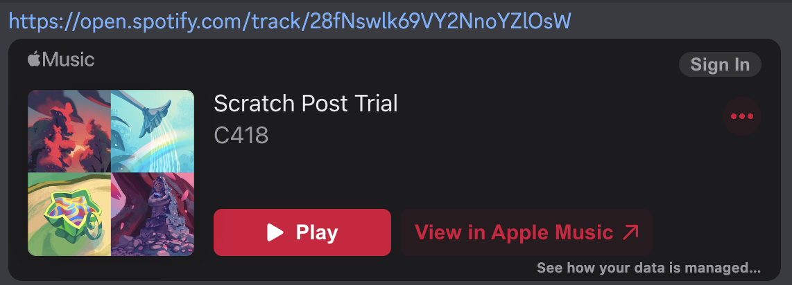

# MyMusicEmbedPlatform

This Vencord plugin displays music embeds using the streaming platform of your choice. It doesn't change message content; just what embeds look like.



The plugin supports converting between the same embed types Discord shows:
- Spotify
- Apple Music
- Amazon Music

This uses [Odesli](https://song.link/) under the hood.

## Installation

As with [installing any custom Vencord plugin](https://docs.vencord.dev/installing/custom-plugins/), you need to compile Vencord from source, placing the `.tsx` inside Vencord's `src/userplugins` directory.

The following script may help on macOS:

```sh
git clone https://github.com/Vendicated/Vencord
cd Vencord
# add `yunruse` (391292177826709504n) as a developer to `src/utils/constants.ts` :)
cp ../MyMusicEmbedPlatform.tsx src/userplugins && pnpm build && pnpm inject && killall Discord;  sleep 0.5 && open -a Discord
```
